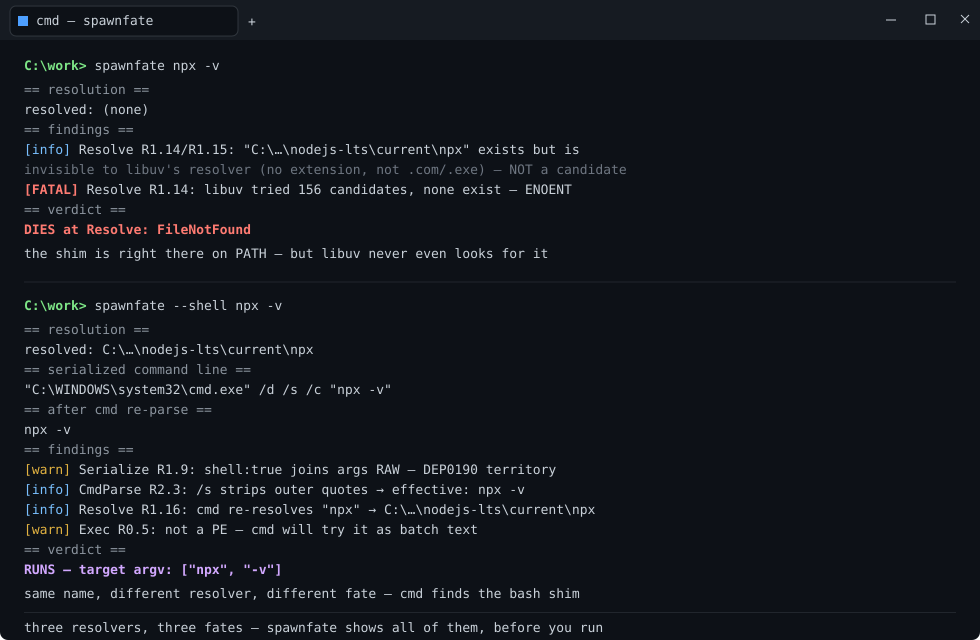

# spawnfate

[](https://github.com/losewayy/spawnfate/actions/workflows/ci.yml)

**Predict the fate of a Windows command line before you spawn it.**

<p align="center"></p>

Every process-spawn API on Windows funnels through layers that don't agree with
each other: the caller serializes argv one way, name resolution probes the
filesystem three different ways, `cmd.exe` re-parses the string under its own
rules, and the target program splits it back into argv with yet another parser.
`spawnfate` simulates every layer — offline, without executing anything — and
tells you where the command dies or gets mangled, and why.

## Demo

```console
$ spawnfate npx -v
== resolution ==
  resolved: (none)
== findings ==
  [info] Resolve R1.14/R1.15: "C:\...\nodejs\npx" exists but is invisible
         to libuv's resolver (no extension, not .com/.exe) — it is NOT a candidate
  [FATAL] Resolve R1.14: libuv tried 156 candidate(s), none exist — spawn fails ENOENT
== verdict ==
  DIES at Resolve: FileNotFound
```

The `npx` shim is sitting right there on PATH — but `spawn('npx')` still fails,
because **libuv's candidate list only ever tries `.com` and `.exe`**. Meanwhile
`spawn('npx.cmd')` throws `EINVAL` (CVE-2024-27980), and `spawn('npx', {shell:true})`
works — but only because cmd.exe re-resolves the name under completely different
rules. Three resolvers, three fates. This tool shows all of them.

## Why this exists

Every spawn wrapper on Windows re-implements the same band-aids privately
(cross-spawn, execa, every agent CLI's `escapeArgForCmd`). The post-CVE-2024
world made it worse: Node now throws `EINVAL` for `.bat`/`.cmd`, Rust's std
returns `InvalidInput` for unescapable args, and the error messages never say
*which layer* broke your string. Nobody built the diagnostic — so here it is.

What it does that nothing else does:

- **Three resolvers, modeled separately.** `CreateProcess` built-in search,
  libuv's `search_path` (`.com`/`.exe` only, CWD-first, PATHEXT ignored), and
  cmd's own PATH/PATHEXT walk. The same name resolves differently depending on
  which one is asking — that difference *is* the bug half the time.
- **cmd.exe re-parse.** The `/c`/`/s` quote-strip decision, metachar hazard scan
  (`& | < > ^`), `%VAR%` expansion (fires even inside quotes), delayed
  `!expansion!`, newline injection.
- **Target parser divergence.** The same string splits differently under
  post-2008 MSVCRT, `CommandLineToArgvW`, Go's own parser, and batch `%1` rules.
  `"a""b c"` is one arg for MSVC programs and **two args for a Go binary**.
- **A conformance corpus** (`corpus/*.yaml`): every rule ships with a
  machine-checkable case — declarative file trees, environment, call, expected
  verdict. Any reimplementation in any language can run the same cases.

## Verified against reality

`spawnfate selftest` materializes each corpus case's declared filesystem into a
temp dir and runs a **real `node` spawn** with the remapped `PATH`/`cwd`, then
compares what actually happened with what we predicted.

```console
$ spawnfate selftest
  ok   node-npx-enoent
  ok   node-npx-cmd-einval
  ok   node-explicit-sh-193          (Node reports EFTYPE — libuv maps 193)
  ok   cmd-resolver-sees-pathext
  ...
selftest: 19 verified against real spawn, 0 diverged
```

Predictions that disagree with reality are bugs in the model, and the suite
fails. That's the bar this project holds itself to.

## Usage

```console
# what does Node's spawn('npx', ['-y', 'pkg', 'C:\My Dir\']) do?
spawnfate npx -y pkg "C:\My Dir\"

# same call but through shell:true (cmd.exe re-parse)
spawnfate --shell npx -v

# the target is a Go binary, not an MSVCRT program?
spawnfate --target go prog "a""b c"

# a raw CreateProcess(lpApplicationName=NULL) command line
spawnfate raw "setup.cmd /q"

# machine-readable
spawnfate --json npx
```

Exit codes: `0` predicted to run, `1` dies before user code, `3` argv cannot be
serialized without mangling.

## Requirements

- Windows (the whole point). Rust 1.7x+ to build from source.
- `selftest` additionally needs `node` on PATH as the ground-truth spawner.

## What it is NOT

- **Not an executor.** It never runs your command. (`selftest` runs only the
  corpus's own declared cases, in a temp dir it created.)
- **Not a fixer.** It diagnoses and prescribes; applying the fix is your call.
- **Not complete.** PowerShell's two-hop parsing, `CreateProcess`'s implicit-`.bat`
  line reconstruction, and non-MSVCRT runtime parsers are modeled but flagged
  where the semantics are uncertain — the corpus is where uncertainty goes to
  be measured.

## Design doc

The rule spec — every parse layer's semantics, tagged `[DOC]`/`[SRC]`/`[EMP]`/`[UNC]`
by evidence level — lives in [`docs/spec-v0.md`](docs/spec-v0.md). The corpus
references rules by id (`R1.14`, `R2.3`, …) so claims stay checkable.

## License

MIT OR Apache-2.0, at your option. See [LICENSE-MIT](LICENSE-MIT) and
[LICENSE-APACHE](LICENSE-APACHE).
